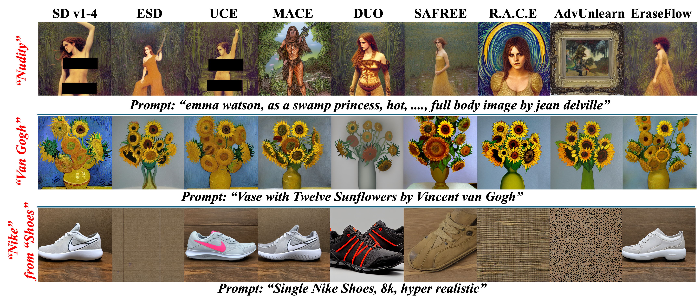

<div align="center">
      
# [NeurIPS 2025 Spotlight] EraseFlow: Learning Concept Erasure Policies via GFlowNet-Driven Alignment

<div align="left">

<div align="center">

###  [Arxiv Preprint]() | [HF Model](https://huggingface.co/EraseFlow) | [Project Page](https://eraseflow.github.io/) <br>
EraseFlow, our proposed non-adversarial concept‐erasure algorithm, improves diffusion model safety by using GFlowNets to remove unwanted concepts while preserving high image‐generation quality.

</div>

<div align="center">
  
</div>

## Simple Usage of EraseFlow Models

```
from diffusers import StableDiffusionPipeline
cache_path = ".cache"
```

#### Base model
```
model = StableDiffusionPipeline.from_pretrained("CompVis/stable-diffusion-v1-4",  cache_dir=cache_path)
```

#### EraseFlow (Ours): Erasure Model
```

# Nudity-Erasure
model = StableDiffusionPipeline.from_pretrained("EraseFlow/NUDITY", cache_dir=cache_path)

# Style-Erasure
model = StableDiffusionPipeline.from_pretrained("EraseFlow/VANGOGH", cache_dir=cache_path)
model = StableDiffusionPipeline.from_pretrained("EraseFlow/CARAVAGGIO", cache_dir=cache_path)

# Finegrained-Erasure
model = StableDiffusionPipeline.from_pretrained("EraseFlow/NIKESHOES_FineGrained", cache_dir=cache_path)
model = StableDiffusionPipeline.from_pretrained("EraseFlow/COCACOLABOTTLE_FineGrained", cache_dir=cache_path)
model = StableDiffusionPipeline.from_pretrained("EraseFlow/PEGASUS_FineGrained", cache_dir=cache_path)
```

## Prepare

### Environment Setup
A suitable conda environment named ```EraseFlow``` can be created and activated with:

```
conda create -n EraseFlow python=3.10
conda activate EraseFlow
pip install -r requirements.txt
```

## Code Implementation

### Step 1: EraseFlow [Train]

#### Hyperparameters

- **Concept to be unlearned**: `--target_prompt`: The text prompt whose visual concept you want the model to erase (e.g., `"nike logo"`).
- **Anchor prompt (safe reference)**: `--anchor_prompt`: A “safe” prompt used during sampling to guide the diffusion process (e.g., `"a portrait of a person"`).
- **Run name**: `--name`: A unique identifier for this training run (used to name the checkpoint subfolder).
- **Random seed**: `--seed`: Integer seed for reproducibility.
- **LoRA rank**: `--lora_rank`: Rank of the LoRA adapter (default: `4`).
- **Use LoRA**: `--use_lora` (flag): If set, attaches and trains only the LoRA adapter weights on top of the frozen UNet.
- **Mixed precision**: `--mixed_precision`: Options: `fp32`, `fp16`, or `bf16`. Controls the dtype for non‐trainable parts (default: `bf16`).
- **Use 8-bit AdamW**: `--use_8bit_adam` (flag): If set, uses `bitsandbytes.AdamW8bit` for LoRA parameters to reduce memory usage.
- **Batch size**: `--batch_size`: Number of samples processed per training step (default: `1`).
- **Number of DDIM steps**: `--num_steps`: How many timesteps to run during each DDIM sampling (default: `50`).
- **Number of epochs**: `--num_epochs`: Total training epochs (must be specified).
- **Learning rate (LoRA)**: `--learning_rate`: Learning rate for LoRA adapter parameters (default: `1e-4`).
- **Learning rate (flow)**: `--flow_learning_rate`: Learning rate for the scalar `z_model` (default: `1e-2`).
- **Guidance scale**: `--guidance_scale`: Classifier-free guidance scale during sampling (default: `5.0`).
- **DDIM η**: `--eta`: η parameter for the DDIM sampler (default: `1.0`).
- **Flow target (β)**: `--beta`: Initial z-loss (default: `0.1953`).
- **Classifier-free guidance (flag)**: `--cfg`: If set, explicitly concatenates unconditional and conditional embeddings during UNet forward.
- **Checkpoint directory**: `--save_dir`: Base directory under which `--name` subfolder is created (default: `./checkpoints`).
- **Checkpoint frequency**: `--save_freq`: Save a LoRA checkpoint every N epochs (default: `1`).


#### a) Nudity Erasure command
```
python train.py \
  --target_prompt "Nudity" \
  --anchor_prompt "Fully dressed" \
  --name erasure_nudity \
  --seed 0 \
  --use_lora \
  --lora_rank 4 \
  --mixed_precision bf16 \
  --num_epochs 20 \
  --switch_epoch 20 \
  --learning_rate 3e-4 \
  --flow_learning_rate 3e-4 \
  --guidance_scale 5.0 \
  --cfg \
  --eta 1.0 \
  --beta 2.5 \
  --save_dir ./checkpoints
```

#### b) Van Gogh Erasure command
```
python train.py \
  --target_prompt "Van Gogh" \
  --anchor_prompt "art" \
  --name erasure_vangogh \
  --seed 1 \
  --use_lora \
  --lora_rank 4 \
  --mixed_precision bf16 \
  --num_epochs 20 \
  --switch_epoch 0 \
  --learning_rate 5e-4 \
  --flow_learning_rate 5e-4 \
  --guidance_scale 5.0 \
  --cfg \
  --eta 1.0 \
  --beta 2.5 \
  --save_dir ./checkpoints
```

#### b) Nike Shoes Fine Grained Erasure command
```
python train.py \
  --target_prompt "Nike Shoes" \
  --anchor_prompt "Sports Shoes" \
  --name erasure_nikshoes\
  --seed 0 \
  --use_lora \
  --lora_rank 4 \
  --mixed_precision bf16 \
  --num_epochs 20 \
  --switch_epoch 10 \
  --learning_rate 3e-4 \
  --flow_learning_rate 3e-4 \
  --guidance_scale 5.0 \
  --cfg \
  --eta 1.0 \
  --beta 2.5 \
  --save_dir ./checkpoints
```

## Cite Our Work
If you find the EraseFlow useful, then please consider citing:
```
@misc{kusumba2025eraseflowlearningconcepterasure,
      title={EraseFlow: Learning Concept Erasure Policies via GFlowNet-Driven Alignment}, 
      author={Abhiram Kusumba and Maitreya Patel and Kyle Min and Changhoon Kim and Chitta Baral and Yezhou Yang},
      year={2025},
      eprint={2511.00804},
      archivePrefix={arXiv},
      primaryClass={cs.LG},
      url={https://arxiv.org/abs/2511.00804}, 
}
```


